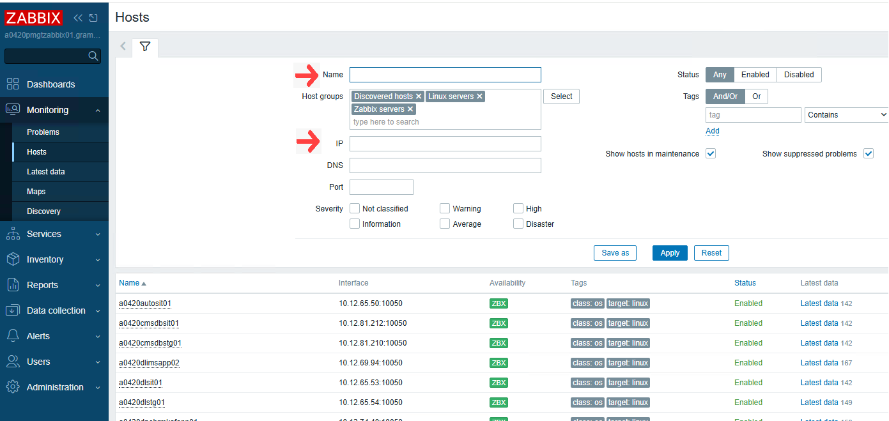

# Zabbix Agent Installation

- [ ] Copy rpm to destination server
- [ ] Confirm files copied into destination server
- [ ] Add route into agent server.
- [ ] Install `zabbix agent2` into host
- [ ] Confirm host agent install successfully.

## Copy RPM file to destination server

We will use `zabbix-agent2` for zabbix agent.
[Why Zabbix Agent2?](https://www.zabbix.com/documentation/current/en/manual/concepts/agent2)

Download `zabbix-agent2` for RHEL 7,8,9.

```bash
# RHEL9
wget https://repo.zabbix.com/zabbix/7.2/release/rhel/9/noarch/zabbix-release-latest-7.2.el9.noarch.rpm
# RHEL 8
wget https://repo.zabbix.com/zabbix/7.2/release/rhel/8/noarch/zabbix-release-latest-7.2.el8.noarch.rpm
# RHEL 7
wget https://repo.zabbix.com/zabbix/7.2/release/rhel/7/noarch/zabbix-release-latest-7.2.el7.noarch.rpm
```
<!-- markdownlint-disable MD036 MD033 -->

```bash
# Navigate to ansible directory
cd ansible/
ansible-playbook -i inventory/inventory.yaml ansible-copy/copy-from-bastion-msg.yaml
```

[Sample Detail Logs](./logs/copy-logs.txt)

**Confirm files copied into destination server**

```bash
ansible all -i inventory/inventory.yaml  -m shell -a 'ls /tmp/zabbix*'
```

[Detail Logs](./logs/copy-confirmation-logs.txt)

**Note:** We can copy any files with the ansible script

## Zabbix – Management Interface Routing Guidelines

<span style="color:red">**Check ROUTE in every host WHY**</span>
<!-- markdownlint-enable MD036 MD033-->
In both **Bogura DA** and **Savar DA** environments, each host is equipped with two network interfaces:

- **Service Interface** – used for general traffic and configured with the default route.
- **Management Interface** – designated for administrative tasks such as monitoring, PAM, etc.

**Add route into agent server.**

```bash
ip route add 10.2.64.8/32 via <gateway ip>
```
<!-- markdownlint-disable MD036 -->
**Also we can add route in file if available**

```bash
cd /etc/sysconfig/network-scripts
$ vim route-ens4
10.2.64.30/32 via 10.12.94.97
10.2.64.37/32 via 10.12.94.97
192.168.135.107/32 via 10.12.94.97
192.168.129.204/32 via 10.12.94.97
10.2.64.8/32 via <gateway ip> # Change the gateway ip
```

As per **Grameenphone Network Guidline all monitoring traffic (e.g., Zabbix communication)** must flow through the **Management Interface**. Since the default route is associated with the Service Interface, monitoring traffic **will not reach the Zabbix server** unless a custom route is configured.

Our **Zabbix Server resides in the Management Zone**, so in order for **Zabbix Agent (e.g., `zabbix-agent2`)** on a host to communicate with the server, a specific route to the management gateway must be added.

---

### Required Configuration by Platform

#### **For OpenStack Platform:**

1. **Allow Port 10051** (Zabbix communication port) in the host's Security Group.
2. **Add a static route** in the OpenStack route table to direct traffic for the Zabbix Server IP (or Management Zone) via the **Management Interface Gateway**.

#### **For VMware or RHEV Platforms:**

- Static routes must be **manually configured on each host** to ensure management traffic (e.g., to the Zabbix server) is routed via the **Management Interface Gateway**.

#### Summary

Without these custom routes, the monitoring traffic will follow the default route via the Service Interface, causing failure in Zabbix communication. Ensuring the correct routing configuration will enable successful monitoring via the Management Interface as intended.

---
<!-- markdownlint-disable MD036 MD026-->
### Install `zabbix-agent2` to Destination hosts using Ansible.

**Check before run the deployment playbook**
<!-- markdownlint-enable MD036 MD026-->
```bash
# Navigate to ansible directory
cd /home/healthcheck/abdulaziz/ansible
ansible-playbook -i inventory/inventory.yaml  play-zabbix/deploy_zabbix.yml --check --diff
```

[Detail logs](./logs/ansible-script-check.txt)

```bash
# Run the deployment playbook
ansible-playbook -i ../inventory/inventory.yaml deploy_zabbix.yml
```

[Command and detail logs](./logs/install-logs.txt)

### Manual Installation if required

```bash
# Install Zabbix Agent
# Copy zabbix-agent2 into /tmp directory as per RHEL version
cd /tmp
cat /etc/redhat-release
# Output: Red Hat Enterprise Linux release 8.5 (Ootpa)
rpm -ivh /tmp/zabbix-agent2-7.2.7-release1.el8.x86_64.rpm # File will copied into tmp dir.
# Configure agent
sudo tee /etc/zabbix/zabbix_agent2.conf > /dev/null <<EOF
PidFile=/run/zabbix/zabbix_agent2.pid
LogFile=/var/log/zabbix/zabbix_agent2.log
LogFileSize=0
Server=127.0.0.1,10.2.64.8
Plugins.System.Capacity=3
ListenPort=10050
ServerActive=10.2.64.8
Hostname=a0420ssecdapmcmscas02  # Make sure change hostname
HostMetadata=Linux_server
Include=/etc/zabbix/zabbix_agent2.d/*.conf
Timeout=10
EOF

# Start and enable service
sudo systemctl enable zabbix-agent2
sudo systemctl start zabbix-agent2
```

## Zabbix configured Host status check from GUI

[Access Zabbix Frontend UI](https://a0420pmgtzabbix01.grameenphone.com/zabbix/)

Login with credential.

After successfull login goto **Monitoring -> Hosts** and search with Name or IP.


## Additional Resources

- [Official Zabbix Documentation](https://www.zabbix.com/documentation/current/en/manual/installation/containers)
- [Zabbix Community Forum](https://www.zabbix.com/forum)
- [Zabbix GitHub Repository](https://github.com/zabbix/zabbix)
- [Zabbix Best Practices Guide](https://www.zabbix.com/documentation/current/en/manual/appendix/install/best_practices)
- [Zabbix Alert Setup](https://youtu.be/9DT7kR8fa0o)
- [Trigger Action](https://youtu.be/aCODvkJPOVY)
